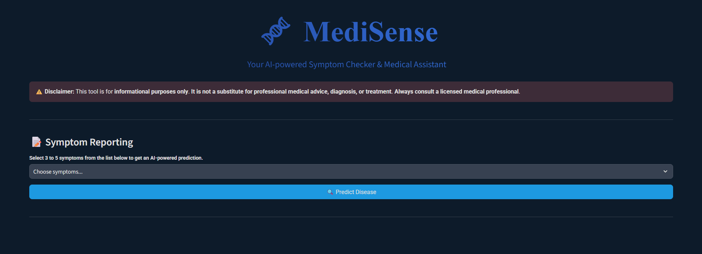
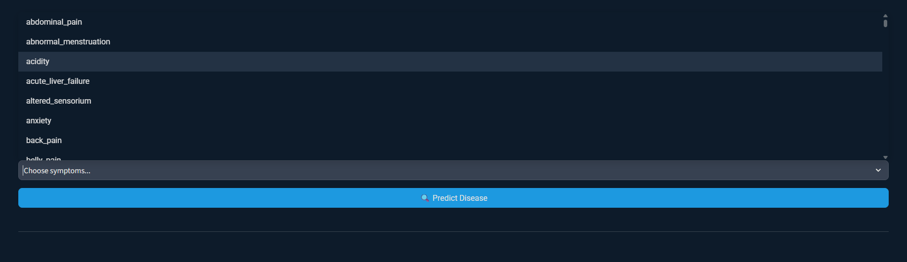
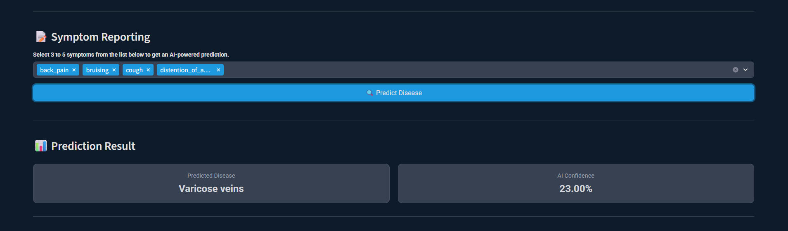
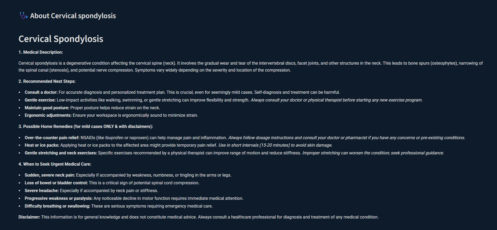

# MediSense - AI-powered Symptom Checker & Medical Assistant

[](https://opensource.org/licenses/MIT)
[](https://streamlit.io/)
[](https://www.python.org/downloads/)

## Overview

**MediSense** is an AI-powered medical assistant that helps users identify potential health conditions based on reported symptoms. Built with Streamlit, this web application uses machine learning to predict diseases and provides detailed information using the Google Gemini API. The application is designed with a clean, responsive interface that works across all devices.

## ✨ Features

- **Symptom Analysis**: Select 3-5 symptoms from a comprehensive list
- **AI-Powered Predictions**: Get instant disease predictions with confidence scores
- **Detailed Disease Information**: Comprehensive details about predicted conditions (requires Google Gemini API key)
- **Responsive Design**: Fully responsive interface that works on desktop and mobile
- **Secure & Private**: No personal health data is stored or logged
- **Educational Tool**: Learn about symptoms and potential conditions

## 🚀 Demo

[](https://mohsinnyz-medisense.streamlit.app/)


## Demo Pictures

### Main Interface

*The main interface where users can select their symptoms from the dropdown menu.*

### Symptom Selection

*Users can select 3-5 symptoms from the comprehensive list.*

### Prediction Results

*The app displays the predicted disease along with confidence level.*

### Detailed Analysis

*The app displays the deatils, remedies, immediate next steps and detailed information about predicted disease.*

### Mobile Responsive

*The app is fully responsive and works well on mobile devices.*

---

## 🛠️ Installation

### Prerequisites
- Python 3.10 or higher
- pip (Python package installer)
- Git (optional, for version control)

### Setup Instructions

1. **Clone the repository**
   ```bash
   git clone https://github.com/yourusername/MediSense.git
   cd MediSense
   ```

2. **Create and activate a virtual environment**
   ```bash
   # Windows
   python -m venv venv
   .\venv\Scripts\activate

   # macOS/Linux
   python3 -m venv venv
   source venv/bin/activate
   ```

3. **Install dependencies**
   ```bash
   pip install -r requirements.txt
   ```

4. **Set up environment variables**
   Create a `.streamlit/secrets.toml` file with your Google Gemini API key:
   ```toml
   GEMINI_API_KEY = "your-google-gemini-api-key"
   ```
   > ℹ️ *Note: The app works without an API key, but detailed disease information won't be available.*

## 🚀 Quick Start

1. **Run the application**
   ```bash
   streamlit run app.py
   ```

2. **Access the app**
   Open your browser and navigate to `http://localhost:8501`

## 🧠 How It Works

1. **Symptom Selection**: Users select 3-5 symptoms from the provided list
2. **Disease Prediction**: The ML model processes the symptoms and predicts the most likely condition
3. **Information Retrieval**: If a Gemini API key is provided, detailed disease information is fetched
4. **Results Display**: The app shows the prediction with confidence level and additional details

## 🏗️ Project Structure

```
MediSense/
├── .streamlit/
│   └── secrets.toml       # API keys and sensitive data
├── venv/                  # Virtual environment (ignored in .gitignore)
├── app.py                 # Main application file
├── requirements.txt       # Project dependencies
└── README.md              # This file
```

## 🤖 Technologies Used

### Core Technologies
- **Streamlit**: Web application framework
- **Scikit-learn**: Machine learning model for disease prediction
- **Google Gemini API**: For fetching detailed disease information
- **Hugging Face Hub**: For hosting and serving ML models

### Dependencies
- Python 3.10+
- streamlit
- scikit-learn
- joblib
- requests
- huggingface_hub

## Model Details

The application uses a pre-trained machine learning model from Hugging Face Hub:
- **Model Repository**: [mohsinnyz/Disease-Guider](https://huggingface.co/mohsinnyz/Disease-Guider)
- **Model Type**: Classification
- **Input**: Selected symptoms (3-5)
- **Output**: Predicted disease with confidence score

## Disclaimer

This application is for **educational and informational purposes only** and is not intended to be a substitute for professional medical advice, diagnosis, or treatment. Always seek the advice of your physician or other qualified health provider with any questions you may have regarding a medical condition.

## License

This project is licensed under the MIT License - see the [LICENSE](LICENSE) file for details.


